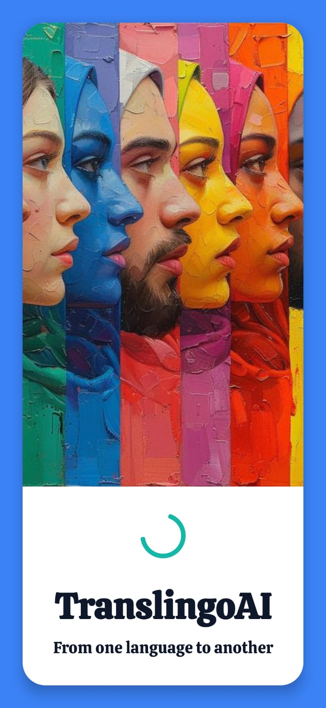
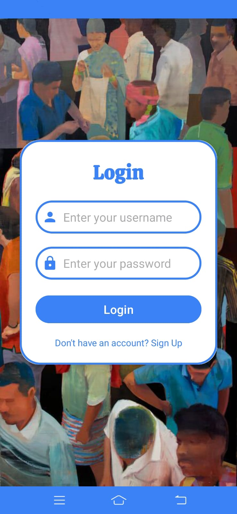
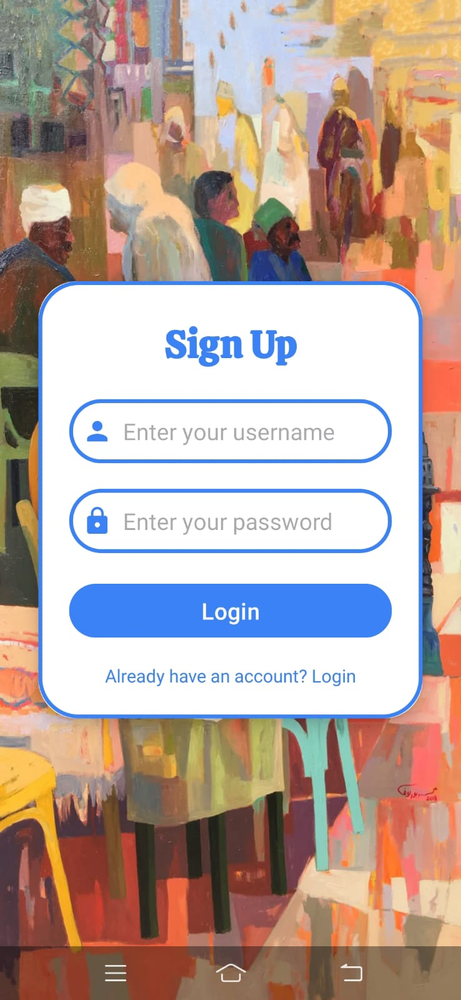
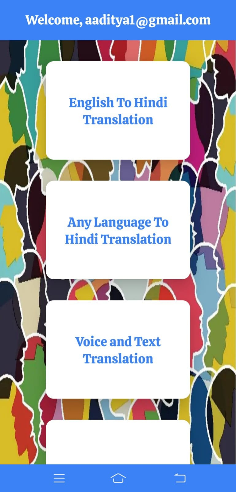
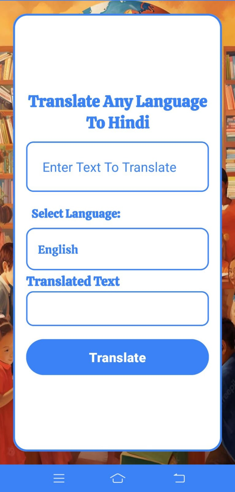
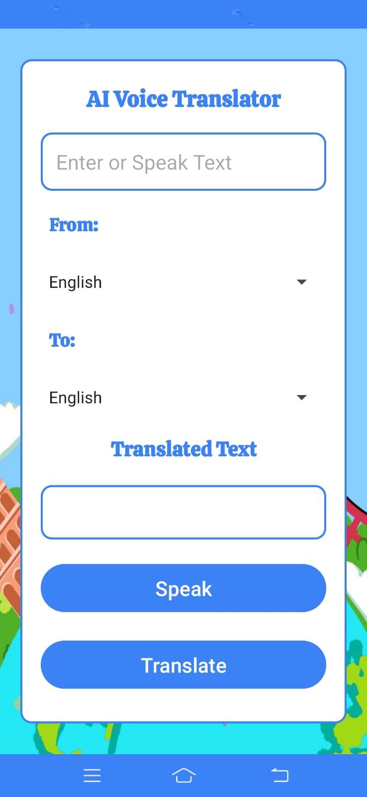
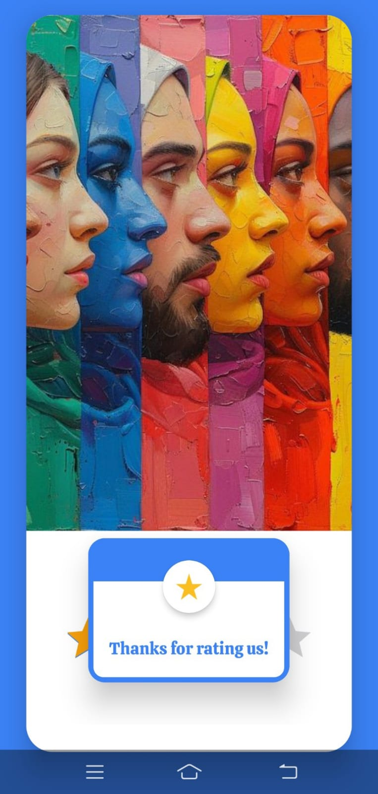

# TransLingoAI Translator App

## Table of Contents

- [TransLingoAI Translator App](#translingoai-translator-app)
  - [Table of Contents](#table-of-contents)
  - [About](#about)
  - [Features](#features)
  - [Technologies Used](#technologies-used)
  - [Setup and Installation](#setup-and-installation)
  - [Project Phases](#project-phases)
    - [Phase 1: English to Hindi Translator](#phase-1-english-to-hindi-translator)
    - [Phase 2: Multi-language to Hindi Translation](#phase-2-multi-language-to-hindi-translation)
  - [Implementation Code](#implementation-code)
  - [How to Use](#how-to-use)
  - [Screenshots](#screenshots)
  - [License](#license)
  - [Conclusion](#conclusion)
  - [Future Scope](#future-scope)
  - [GitHub Repository](#github-repository)

---

## About

**TransLingoAI** is an AI-powered mobile application built with Kotlin that enables real-time language translation with a focus on **English to Hindi** and **any language to Hindi** translations using **Google ML Kit**. The app is designed for usability in official settings, government platforms, and for general public use.

---

## Features

- 🔤 **AI-based language translation**
- 🌐 **Supports English to Hindi and Any Language to Hindi**
- 🗣️ **Voice input translation**
- 🎤 **Text-to-speech playback for translations**
- 📜 **Translation history tracking**
- 🧾 **Custom EditText** for stylized input
- ⭐ **RatingBar** to rate translated results
- 🧭 **Custom Spinner** to select languages
- 📶 **Offline translation model support**
- ⚙️ **SharedPreferences** based login/signup
- 🧁 **Custom toasts** for alerts and messages
- 🔧 **Custom Toolbar** for sleek UI
- 🔄 **ProgressBar** for live feedback
- 🎬 **Splash screen** for polished loading UX

---

## Technologies Used

- **Frontend:** Kotlin, Android XML
- **Backend/API:** Google ML Kit Translation API
- **Other Tools:**
  - Android SDK
  - SharedPreferences for local storage
  - Google TextToSpeech
  - Custom UI components (Toast, Toolbar, EditText)

---

## Setup and Installation

1. **Clone the repository**:

   ```bash
   git clone https://github.com/your-username/TransLingoAI.git
   ```

2. **Open in Android Studio**.

3. **Add ML Kit Dependency** in your `build.gradle (app)`:

   ```groovy
   implementation("com.google.mlkit:translate:17.0.3")
   ```

4. **Sync the project**, connect your emulator/device, and **Run the App**.

---

## Project Phases

### Phase 1: English to Hindi Translator

- Utilized ML Kit to implement real-time translation from English to Hindi.
- Integrated offline language model download.
- Enabled voice input using Android SpeechRecognizer.

### Phase 2: Multi-language to Hindi Translation

- Added **language selector spinner**.
- Enabled translation from **any selected language** to Hindi.
- Implemented translation history and rating system.

---

## Implementation Code

```kotlin
class MainActivity : AppCompatActivity() {
    private lateinit var translator: Translator

    override fun onCreate(savedInstanceState: Bundle?) {
        super.onCreate(savedInstanceState)
        setContentView(R.layout.activity_main)

        val inputText = findViewById<EditText>(R.id.inputText)
        val outputText = findViewById<TextView>(R.id.outputText)
        val translateButton = findViewById<Button>(R.id.translateButton)

        val sourceLang = TranslateLanguage.ENGLISH
        val targetLang = TranslateLanguage.HINDI

        val options = TranslatorOptions.Builder()
            .setSourceLanguage(sourceLang)
            .setTargetLanguage(targetLang)
            .build()

        translator = Translation.getClient(options)
        val conditions = DownloadConditions.Builder().requireWifi().build()

        translator.downloadModelIfNeeded(conditions)
            .addOnSuccessListener {
                translateButton.setOnClickListener {
                    translateText(inputText.text.toString(), outputText)
                }
            }
            .addOnFailureListener {
                outputText.text = "Download Error!"
            }
    }

    private fun translateText(text: String, outputView: TextView) {
        translator.translate(text)
            .addOnSuccessListener { outputView.text = it }
            .addOnFailureListener { outputView.text = "Translation Error!" }
    }

    override fun onDestroy() {
        super.onDestroy()
        translator.close()
    }
}
```

---

## How to Use

1. Launch the app.
2. Log in or sign up.
3. Enter text in English or any selected language.
4. Tap the **Translate** button.
5. View translated text in Hindi.
6. Optionally use **voice input** or listen to the **Text-to-Speech output**.
7. Rate the translation or view previous translations.

---

## Screenshots

| Splash Screen                              | Login Screen                                |
| ------------------------------------------ | ------------------------------------------- |
|  |    |
| Signup Screen                              | Home Screen                                 |
|  |     |
| Text Screen                                | Spinner Translation Screen                  |
|    |  |
| Voice Screen                               | Rate Us Screen                              |
|   |     |

---

## License

This project is licensed under the [MIT License](https://opensource.org/licenses/MIT).

---

## Conclusion

**TransLingoAI** provides a seamless, AI-driven translation experience with support for offline usage and voice-based inputs. The intuitive UI and native Android implementation make it accessible and responsive for users across various contexts.

---

## Future Scope

- 🌍 Add **Hindi to English** and **multi-directional** translation.
- 📦 Export translation history to PDF/Excel.
- 🔊 Improve voice recognition accuracy using advanced NLP.
- ☁️ Cloud sync for user data across devices.
- 👁️ OCR support for translating text from images.

---

## GitHub Repository

🔗 [GitHub - TransLingoAI](https://github.com/Aaditya-Kumar-Mittal/TransLingoAI-Translator-Application)

---
